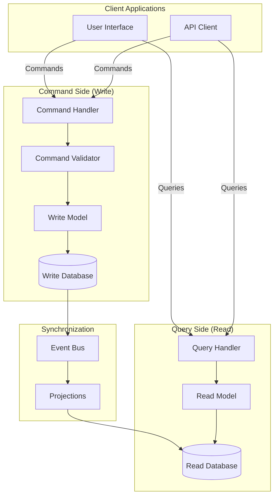

# CQRS Architecture

**Command Query Responsibility Segregation (CQRS)** is an architectural pattern that separates read operations (queries) from write operations (commands), allowing each to be optimized independently.

<Callout type="info">
CQRS recognizes that read and write workloads have fundamentally different requirements - reads need speed and denormalization, while writes need consistency and validation.
</Callout>

## Architecture Overview



## Core Concepts

### Commands vs Queries

<Tabs items={['Commands', 'Queries', 'Comparison']}>
<Tab value="Commands">
Commands represent **intentions to change state**. They are imperative and named in the present tense.

```typescript title="commands/create-order.command.ts"
// Command - represents intent to change state
interface CreateOrderCommand {
  readonly type: 'CreateOrder';
  readonly customerId: string;
  readonly items: ReadonlyArray<{
    productId: string;
    quantity: number;
    unitPrice: number;
  }>;
  readonly shippingAddress: Address;
  readonly metadata: {
    correlationId: string;
    timestamp: Date;
    userId: string;
  };
}

interface UpdateOrderStatusCommand {
  readonly type: 'UpdateOrderStatus';
  readonly orderId: string;
  readonly newStatus: OrderStatus;
  readonly reason?: string;
  readonly metadata: CommandMetadata;
}

interface CancelOrderCommand {
  readonly type: 'CancelOrder';
  readonly orderId: string;
  readonly cancellationReason: string;
  readonly refundRequested: boolean;
  readonly metadata: CommandMetadata;
}

// Command metadata for tracing and auditing
interface CommandMetadata {
  readonly correlationId: string;
  readonly causationId?: string;
  readonly timestamp: Date;
  readonly userId: string;
  readonly source: string;
}
```

**Command Characteristics:**
- Named as verbs (CreateOrder, UpdateStatus, CancelOrder)
- Immutable - cannot be modified after creation
- Contain all data needed to perform the operation
- Return void or acknowledgment (not data)
- Can be rejected or fail validation
</Tab>
<Tab value="Queries">
Queries represent **requests for data**. They are interrogative and should never modify state.

```typescript title="queries/get-order.query.ts"
// Query - represents request for data
interface GetOrderByIdQuery {
  readonly type: 'GetOrderById';
  readonly orderId: string;
}

interface GetOrdersByCustomerQuery {
  readonly type: 'GetOrdersByCustomer';
  readonly customerId: string;
  readonly status?: OrderStatus;
  readonly pagination: {
    page: number;
    pageSize: number;
  };
  readonly sorting?: {
    field: string;
    direction: 'asc' | 'desc';
  };
}

interface SearchOrdersQuery {
  readonly type: 'SearchOrders';
  readonly filters: {
    dateRange?: { start: Date; end: Date };
    statuses?: OrderStatus[];
    minTotal?: number;
    maxTotal?: number;
    productIds?: string[];
  };
  readonly pagination: PaginationParams;
}

// Query result types
interface OrderDetailsReadModel {
  readonly id: string;
  readonly customerName: string;
  readonly customerEmail: string;
  readonly items: OrderItemReadModel[];
  readonly status: string;
  readonly statusHistory: StatusChange[];
  readonly total: number;
  readonly shippingAddress: string;
  readonly createdAt: Date;
  readonly estimatedDelivery?: Date;
}

interface OrderListReadModel {
  readonly orders: OrderSummary[];
  readonly totalCount: number;
  readonly page: number;
  readonly pageSize: number;
  readonly hasNextPage: boolean;
}
```

**Query Characteristics:**
- Named as questions (GetOrderById, SearchOrders)
- Never modify state (side-effect free)
- Return data optimized for the use case
- Can be cached aggressively
- Support filtering, pagination, sorting
</Tab>
<Tab value="Comparison">
```typescript title="cqrs-comparison.ts"
// ❌ Traditional CRUD - mixed concerns
interface OrderService {
  // Mixes read and write operations
  createOrder(data: CreateOrderDto): Promise<Order>;
  getOrder(id: string): Promise<Order>;
  updateOrder(id: string, data: UpdateOrderDto): Promise<Order>;
  listOrders(filters: OrderFilters): Promise<Order[]>;
  deleteOrder(id: string): Promise<void>;
}

// ✅ CQRS - separated concerns
interface OrderCommandHandler {
  // Write operations only
  handle(command: CreateOrderCommand): Promise<void>;
  handle(command: UpdateOrderStatusCommand): Promise<void>;
  handle(command: CancelOrderCommand): Promise<void>;
}

interface OrderQueryHandler {
  // Read operations only
  handle(query: GetOrderByIdQuery): Promise<OrderDetailsReadModel>;
  handle(query: GetOrdersByCustomerQuery): Promise<OrderListReadModel>;
  handle(query: SearchOrdersQuery): Promise<OrderSearchResult>;
}

// Benefits of separation:
// 1. Different scaling strategies for reads vs writes
// 2. Optimized data models for each use case
// 3. Independent deployment and versioning
// 4. Easier caching on read side
// 5. Different consistency guarantees
```
</Tab>
</Tabs>

## Command Side Implementation

<Steps>
### Define Commands

```typescript title="commands/index.ts"
// Base command interface
interface Command<T extends string = string> {
  readonly type: T;
  readonly metadata: CommandMetadata;
}

interface CommandMetadata {
  readonly correlationId: string;
  readonly causationId?: string;
  readonly timestamp: Date;
  readonly userId: string;
}

// Order commands
interface CreateOrderCommand extends Command<'CreateOrder'> {
  readonly customerId: string;
  readonly items: OrderItemInput[];
  readonly shippingAddress: Address;
}

interface AddOrderItemCommand extends Command<'AddOrderItem'> {
  readonly orderId: string;
  readonly productId: string;
  readonly quantity: number;
}

interface RemoveOrderItemCommand extends Command<'RemoveOrderItem'> {
  readonly orderId: string;
  readonly itemId: string;
}

interface SubmitOrderCommand extends Command<'SubmitOrder'> {
  readonly orderId: string;
  readonly paymentMethod: PaymentMethod;
}

// Command factory for consistency
const createCommand = <T extends Command>(
  type: T['type'],
  payload: Omit<T, 'type' | 'metadata'>,
  userId: string
): T => ({
  type,
  ...payload,
  metadata: {
    correlationId: crypto.randomUUID(),
    timestamp: new Date(),
    userId,
  },
} as T);
```

### Create Command Handlers

```typescript title="handlers/create-order.handler.ts"
import { OrderRepository } from '../repositories/order.repository';
import { EventBus } from '../events/event-bus';
import { OrderCreatedEvent } from '../events/order.events';

interface CommandHandler<T extends Command> {
  handle(command: T): Promise<void>;
}

const createOrderHandler = (
  orderRepository: OrderRepository,
  eventBus: EventBus,
  validator: OrderValidator
): CommandHandler<CreateOrderCommand> => ({
  async handle(command: CreateOrderCommand): Promise<void> {
    // 1. Validate command
    const validationResult = await validator.validateCreateOrder(command);
    if (!validationResult.isValid) {
      throw new ValidationError(validationResult.errors);
    }

    // 2. Check business rules
    const customer = await customerRepository.findById(command.customerId);
    if (!customer) {
      throw new BusinessRuleError('Customer not found');
    }

    if (customer.status === 'suspended') {
      throw new BusinessRuleError('Customer account is suspended');
    }

    // 3. Create aggregate
    const order = Order.create({
      id: generateOrderId(),
      customerId: command.customerId,
      items: command.items.map(item => OrderItem.create(item)),
      shippingAddress: command.shippingAddress,
      status: 'draft',
      createdAt: new Date(),
    });

    // 4. Calculate totals
    order.calculateTotals();

    // 5. Persist to write model
    await orderRepository.save(order);

    // 6. Publish domain events
    await eventBus.publish(
      OrderCreatedEvent.create({
        orderId: order.id,
        customerId: order.customerId,
        items: order.items,
        total: order.total,
        correlationId: command.metadata.correlationId,
      })
    );
  },
});
```

### Implement Command Bus

```typescript title="infrastructure/command-bus.ts"
type CommandType = string;
type HandlerMap = Map<CommandType, CommandHandler<any>>;

interface CommandBus {
  register<T extends Command>(type: T['type'], handler: CommandHandler<T>): void;
  dispatch<T extends Command>(command: T): Promise<void>;
}

const createCommandBus = (
  middlewares: CommandMiddleware[] = []
): CommandBus => {
  const handlers: HandlerMap = new Map();

  const dispatch = async <T extends Command>(command: T): Promise<void> => {
    const handler = handlers.get(command.type);
    if (!handler) {
      throw new Error(`No handler registered for command: ${command.type}`);
    }

    // Build middleware chain
    const chain = middlewares.reduceRight(
      (next, middleware) => () => middleware(command, next),
      () => handler.handle(command)
    );

    await chain();
  };

  return {
    register: (type, handler) => {
      if (handlers.has(type)) {
        throw new Error(`Handler already registered for: ${type}`);
      }
      handlers.set(type, handler);
    },
    dispatch,
  };
};

// Middleware types
type CommandMiddleware = (
  command: Command,
  next: () => Promise<void>
) => Promise<void>;

// Logging middleware
const loggingMiddleware: CommandMiddleware = async (command, next) => {
  const start = Date.now();
  console.log(`[Command] ${command.type} started`, {
    correlationId: command.metadata.correlationId,
  });

  try {
    await next();
    console.log(`[Command] ${command.type} completed in ${Date.now() - start}ms`);
  } catch (error) {
    console.error(`[Command] ${command.type} failed`, error);
    throw error;
  }
};

// Validation middleware
const validationMiddleware = (
  validators: Map<string, Validator>
): CommandMiddleware => async (command, next) => {
  const validator = validators.get(command.type);
  if (validator) {
    const result = await validator.validate(command);
    if (!result.isValid) {
      throw new ValidationError(result.errors);
    }
  }
  await next();
};

// Transaction middleware
const transactionMiddleware = (
  unitOfWork: UnitOfWork
): CommandMiddleware => async (command, next) => {
  await unitOfWork.begin();
  try {
    await next();
    await unitOfWork.commit();
  } catch (error) {
    await unitOfWork.rollback();
    throw error;
  }
};
```

### Write Model (Aggregates)

```typescript title="domain/order.aggregate.ts"
// Write model - optimized for business logic and consistency
interface Order {
  readonly id: string;
  readonly customerId: string;
  readonly items: OrderItem[];
  readonly status: OrderStatus;
  readonly shippingAddress: Address;
  readonly subtotal: number;
  readonly tax: number;
  readonly shipping: number;
  readonly total: number;
  readonly version: number;
  readonly createdAt: Date;
  readonly updatedAt: Date;
}

interface OrderItem {
  readonly id: string;
  readonly productId: string;
  readonly productName: string;
  readonly quantity: number;
  readonly unitPrice: number;
  readonly lineTotal: number;
}

type OrderStatus = 'draft' | 'pending' | 'confirmed' | 'shipped' | 'delivered' | 'cancelled';

// Order aggregate with business logic
const Order = {
  create: (props: CreateOrderProps): Order => ({
    id: props.id ?? generateId(),
    customerId: props.customerId,
    items: [],
    status: 'draft',
    shippingAddress: props.shippingAddress,
    subtotal: 0,
    tax: 0,
    shipping: 0,
    total: 0,
    version: 0,
    createdAt: new Date(),
    updatedAt: new Date(),
  }),

  addItem: (order: Order, item: OrderItemInput): Order => {
    if (order.status !== 'draft') {
      throw new BusinessRuleError('Cannot add items to non-draft order');
    }

    const existingItem = order.items.find(i => i.productId === item.productId);
    
    const updatedItems = existingItem
      ? order.items.map(i =>
          i.productId === item.productId
            ? { ...i, quantity: i.quantity + item.quantity, lineTotal: (i.quantity + item.quantity) * i.unitPrice }
            : i
        )
      : [...order.items, {
          id: generateId(),
          productId: item.productId,
          productName: item.productName,
          quantity: item.quantity,
          unitPrice: item.unitPrice,
          lineTotal: item.quantity * item.unitPrice,
        }];

    return Order.recalculateTotals({
      ...order,
      items: updatedItems,
      updatedAt: new Date(),
      version: order.version + 1,
    });
  },

  removeItem: (order: Order, itemId: string): Order => {
    if (order.status !== 'draft') {
      throw new BusinessRuleError('Cannot remove items from non-draft order');
    }

    return Order.recalculateTotals({
      ...order,
      items: order.items.filter(i => i.id !== itemId),
      updatedAt: new Date(),
      version: order.version + 1,
    });
  },

  submit: (order: Order): Order => {
    if (order.status !== 'draft') {
      throw new BusinessRuleError('Only draft orders can be submitted');
    }

    if (order.items.length === 0) {
      throw new BusinessRuleError('Cannot submit empty order');
    }

    return {
      ...order,
      status: 'pending',
      updatedAt: new Date(),
      version: order.version + 1,
    };
  },

  recalculateTotals: (order: Order): Order => {
    const subtotal = order.items.reduce((sum, item) => sum + item.lineTotal, 0);
    const tax = subtotal * 0.1; // 10% tax
    const shipping = subtotal > 100 ? 0 : 10; // Free shipping over $100
    const total = subtotal + tax + shipping;

    return { ...order, subtotal, tax, shipping, total };
  },
};
```
</Steps>

## Query Side Implementation

<Steps>
### Define Read Models

```typescript title="read-models/order.read-model.ts"
// Read models - optimized for queries, denormalized
interface OrderDetailsReadModel {
  // Flattened customer info (no joins needed)
  readonly orderId: string;
  readonly orderNumber: string;
  readonly customerId: string;
  readonly customerName: string;
  readonly customerEmail: string;
  readonly customerPhone: string;
  
  // Order details
  readonly status: string;
  readonly statusLabel: string;
  readonly statusColor: string;
  
  // Items with product details embedded
  readonly items: ReadonlyArray<{
    itemId: string;
    productId: string;
    productName: string;
    productImage: string;
    productSku: string;
    quantity: number;
    unitPrice: number;
    lineTotal: number;
  }>;
  
  // Pre-calculated totals
  readonly subtotal: number;
  readonly taxAmount: number;
  readonly taxRate: number;
  readonly shippingCost: number;
  readonly discountAmount: number;
  readonly total: number;
  
  // Formatted address string
  readonly shippingAddress: string;
  readonly billingAddress: string;
  
  // Timestamps
  readonly createdAt: Date;
  readonly updatedAt: Date;
  readonly submittedAt?: Date;
  readonly shippedAt?: Date;
  readonly deliveredAt?: Date;
  
  // Timeline for UI
  readonly timeline: ReadonlyArray<{
    event: string;
    timestamp: Date;
    description: string;
  }>;
}

// List view - minimal data for performance
interface OrderListItemReadModel {
  readonly orderId: string;
  readonly orderNumber: string;
  readonly customerName: string;
  readonly status: string;
  readonly statusColor: string;
  readonly itemCount: number;
  readonly total: number;
  readonly createdAt: Date;
}

// Dashboard aggregates
interface OrderDashboardReadModel {
  readonly totalOrders: number;
  readonly pendingOrders: number;
  readonly shippedOrders: number;
  readonly totalRevenue: number;
  readonly averageOrderValue: number;
  readonly ordersByStatus: Record<string, number>;
  readonly recentOrders: OrderListItemReadModel[];
  readonly topProducts: Array<{
    productId: string;
    productName: string;
    totalQuantity: number;
    totalRevenue: number;
  }>;
}
```

### Create Query Handlers

```typescript title="handlers/order-queries.handler.ts"
interface QueryHandler<Q, R> {
  handle(query: Q): Promise<R>;
}

// Get order details
const getOrderDetailsHandler = (
  readDb: ReadDatabase
): QueryHandler<GetOrderByIdQuery, OrderDetailsReadModel | null> => ({
  async handle(query: GetOrderByIdQuery) {
    // Direct read from denormalized read database
    const result = await readDb.query<OrderDetailsReadModel>(
      `SELECT * FROM order_details_view WHERE order_id = $1`,
      [query.orderId]
    );
    
    return result.rows[0] ?? null;
  },
});

// List orders with filtering and pagination
const listOrdersHandler = (
  readDb: ReadDatabase,
  cache: CacheService
): QueryHandler<GetOrdersByCustomerQuery, OrderListReadModel> => ({
  async handle(query: GetOrdersByCustomerQuery) {
    const cacheKey = `orders:${query.customerId}:${JSON.stringify(query)}`;
    
    // Try cache first
    const cached = await cache.get<OrderListReadModel>(cacheKey);
    if (cached) return cached;

    // Build dynamic query
    const { sql, params } = buildOrderListQuery(query);
    
    const [orders, countResult] = await Promise.all([
      readDb.query<OrderListItemReadModel>(sql, params),
      readDb.query<{ count: number }>(
        `SELECT COUNT(*) as count FROM order_list_view 
         WHERE customer_id = $1 ${query.status ? 'AND status = $2' : ''}`,
        query.status ? [query.customerId, query.status] : [query.customerId]
      ),
    ]);

    const result: OrderListReadModel = {
      orders: orders.rows,
      totalCount: countResult.rows[0].count,
      page: query.pagination.page,
      pageSize: query.pagination.pageSize,
      hasNextPage: countResult.rows[0].count > query.pagination.page * query.pagination.pageSize,
    };

    // Cache for 30 seconds
    await cache.set(cacheKey, result, 30);
    
    return result;
  },
});

// Search with full-text search
const searchOrdersHandler = (
  searchService: SearchService
): QueryHandler<SearchOrdersQuery, OrderSearchResult> => ({
  async handle(query: SearchOrdersQuery) {
    return searchService.search('orders', {
      filters: query.filters,
      pagination: query.pagination,
      sorting: query.sorting,
    });
  },
});

// Query builder helper
const buildOrderListQuery = (query: GetOrdersByCustomerQuery) => {
  const conditions: string[] = ['customer_id = $1'];
  const params: any[] = [query.customerId];
  let paramIndex = 2;

  if (query.status) {
    conditions.push(`status = $${paramIndex}`);
    params.push(query.status);
    paramIndex++;
  }

  const orderBy = query.sorting
    ? `ORDER BY ${query.sorting.field} ${query.sorting.direction}`
    : 'ORDER BY created_at DESC';

  const offset = (query.pagination.page - 1) * query.pagination.pageSize;

  return {
    sql: `
      SELECT * FROM order_list_view
      WHERE ${conditions.join(' AND ')}
      ${orderBy}
      LIMIT $${paramIndex} OFFSET $${paramIndex + 1}
    `,
    params: [...params, query.pagination.pageSize, offset],
  };
};
```

### Implement Query Bus

```typescript title="infrastructure/query-bus.ts"
interface QueryBus {
  register<Q, R>(queryType: string, handler: QueryHandler<Q, R>): void;
  execute<Q, R>(query: Q & { type: string }): Promise<R>;
}

const createQueryBus = (): QueryBus => {
  const handlers = new Map<string, QueryHandler<any, any>>();

  return {
    register: (queryType, handler) => {
      handlers.set(queryType, handler);
    },

    execute: async (query) => {
      const handler = handlers.get(query.type);
      if (!handler) {
        throw new Error(`No handler for query: ${query.type}`);
      }
      return handler.handle(query);
    },
  };
};

// With caching decorator
const withCaching = <Q, R>(
  handler: QueryHandler<Q, R>,
  cache: CacheService,
  keyFn: (query: Q) => string,
  ttl: number
): QueryHandler<Q, R> => ({
  async handle(query: Q): Promise<R> {
    const key = keyFn(query);
    const cached = await cache.get<R>(key);
    if (cached) return cached;

    const result = await handler.handle(query);
    await cache.set(key, result, ttl);
    return result;
  },
});
```
</Steps>

## Synchronization (Projections)

The read model must stay synchronized with the write model. This is done through **projections** that listen to domain events.

<Tabs items={['Event-Based Sync', 'Projections', 'Eventual Consistency']}>
<Tab value="Event-Based Sync">
```typescript title="projections/order-projection.ts"
interface Projection<E extends DomainEvent> {
  readonly eventTypes: string[];
  project(event: E): Promise<void>;
}

// Order read model projection
const createOrderProjection = (
  readDb: ReadDatabase
): Projection<OrderEvent> => ({
  eventTypes: [
    'OrderCreated',
    'OrderItemAdded',
    'OrderItemRemoved',
    'OrderSubmitted',
    'OrderShipped',
    'OrderDelivered',
    'OrderCancelled',
  ],

  async project(event: OrderEvent): Promise<void> {
    switch (event.type) {
      case 'OrderCreated':
        await handleOrderCreated(readDb, event);
        break;
      case 'OrderItemAdded':
        await handleItemAdded(readDb, event);
        break;
      case 'OrderSubmitted':
        await handleOrderSubmitted(readDb, event);
        break;
      case 'OrderShipped':
        await handleOrderShipped(readDb, event);
        break;
      // ... other handlers
    }
  },
});

const handleOrderCreated = async (
  readDb: ReadDatabase,
  event: OrderCreatedEvent
) => {
  // Fetch customer data for denormalization
  const customer = await readDb.query(
    'SELECT name, email, phone FROM customers WHERE id = $1',
    [event.data.customerId]
  );

  // Insert into read model with all denormalized data
  await readDb.query(
    `INSERT INTO order_details_view (
      order_id, order_number, customer_id, customer_name, 
      customer_email, customer_phone, status, status_label,
      status_color, subtotal, tax_amount, shipping_cost,
      total, shipping_address, created_at, timeline
    ) VALUES ($1, $2, $3, $4, $5, $6, $7, $8, $9, $10, $11, $12, $13, $14, $15, $16)`,
    [
      event.data.orderId,
      event.data.orderNumber,
      event.data.customerId,
      customer.rows[0].name,
      customer.rows[0].email,
      customer.rows[0].phone,
      'draft',
      'Draft',
      'gray',
      0,
      0,
      0,
      0,
      formatAddress(event.data.shippingAddress),
      event.timestamp,
      JSON.stringify([{
        event: 'Order Created',
        timestamp: event.timestamp,
        description: 'Order was created',
      }]),
    ]
  );

  // Also insert into list view
  await readDb.query(
    `INSERT INTO order_list_view (
      order_id, order_number, customer_name, status,
      status_color, item_count, total, created_at
    ) VALUES ($1, $2, $3, $4, $5, $6, $7, $8)`,
    [
      event.data.orderId,
      event.data.orderNumber,
      customer.rows[0].name,
      'draft',
      'gray',
      0,
      0,
      event.timestamp,
    ]
  );
};

const handleOrderShipped = async (
  readDb: ReadDatabase,
  event: OrderShippedEvent
) => {
  // Update read models
  await Promise.all([
    readDb.query(
      `UPDATE order_details_view 
       SET status = $1, status_label = $2, status_color = $3,
           shipped_at = $4, tracking_number = $5,
           timeline = timeline || $6::jsonb
       WHERE order_id = $7`,
      [
        'shipped',
        'Shipped',
        'blue',
        event.timestamp,
        event.data.trackingNumber,
        JSON.stringify({
          event: 'Order Shipped',
          timestamp: event.timestamp,
          description: `Shipped via ${event.data.carrier}. Tracking: ${event.data.trackingNumber}`,
        }),
        event.data.orderId,
      ]
    ),
    readDb.query(
      `UPDATE order_list_view 
       SET status = $1, status_color = $2
       WHERE order_id = $3`,
      ['shipped', 'blue', event.data.orderId]
    ),
  ]);

  // Invalidate cache
  await cache.invalidate(`orders:*:${event.data.customerId}:*`);
};
```
</Tab>
<Tab value="Projections">
```typescript title="infrastructure/projection-engine.ts"
interface ProjectionEngine {
  register(projection: Projection<any>): void;
  start(): Promise<void>;
  stop(): Promise<void>;
  rebuild(projectionName: string): Promise<void>;
}

const createProjectionEngine = (
  eventStore: EventStore,
  checkpointStore: CheckpointStore
): ProjectionEngine => {
  const projections: Projection<any>[] = [];
  let running = false;

  const processEvent = async (event: DomainEvent) => {
    for (const projection of projections) {
      if (projection.eventTypes.includes(event.type)) {
        try {
          await projection.project(event);
        } catch (error) {
          console.error(`Projection failed for ${event.type}`, error);
          // Dead letter queue or retry logic
          await handleProjectionError(event, projection, error);
        }
      }
    }
  };

  return {
    register: (projection) => {
      projections.push(projection);
    },

    start: async () => {
      running = true;
      
      // Get last processed position
      const checkpoint = await checkpointStore.get('projections');
      
      // Subscribe to event stream from checkpoint
      const subscription = await eventStore.subscribeFromPosition(
        checkpoint?.position ?? 0,
        async (event, position) => {
          if (!running) return;
          
          await processEvent(event);
          await checkpointStore.save('projections', { position });
        }
      );
    },

    stop: async () => {
      running = false;
    },

    rebuild: async (projectionName: string) => {
      const projection = projections.find(p => p.name === projectionName);
      if (!projection) throw new Error(`Projection not found: ${projectionName}`);

      // Clear existing read model data
      await projection.reset();

      // Replay all events
      const events = await eventStore.readAll();
      for (const event of events) {
        if (projection.eventTypes.includes(event.type)) {
          await projection.project(event);
        }
      }
    },
  };
};

// Checkpoint store for tracking projection progress
interface CheckpointStore {
  get(name: string): Promise<Checkpoint | null>;
  save(name: string, checkpoint: Checkpoint): Promise<void>;
}

interface Checkpoint {
  position: number;
  updatedAt: Date;
}
```
</Tab>
<Tab value="Eventual Consistency">
```typescript title="consistency/eventual-consistency.ts"
// Handling eventual consistency in the UI
interface ConsistencyManager {
  waitForProjection(correlationId: string, timeout?: number): Promise<void>;
  notifyProjectionComplete(correlationId: string): void;
}

const createConsistencyManager = (): ConsistencyManager => {
  const pending = new Map<string, {
    resolve: () => void;
    reject: (error: Error) => void;
  }>();

  return {
    waitForProjection: (correlationId, timeout = 5000) => {
      return new Promise((resolve, reject) => {
        const timer = setTimeout(() => {
          pending.delete(correlationId);
          reject(new Error('Projection timeout'));
        }, timeout);

        pending.set(correlationId, {
          resolve: () => {
            clearTimeout(timer);
            resolve();
          },
          reject,
        });
      });
    },

    notifyProjectionComplete: (correlationId) => {
      const handler = pending.get(correlationId);
      if (handler) {
        handler.resolve();
        pending.delete(correlationId);
      }
    },
  };
};

// API endpoint with consistency handling
const createOrderEndpoint = async (
  req: Request,
  commandBus: CommandBus,
  consistencyManager: ConsistencyManager
) => {
  const command: CreateOrderCommand = {
    type: 'CreateOrder',
    ...req.body,
    metadata: {
      correlationId: crypto.randomUUID(),
      timestamp: new Date(),
      userId: req.user.id,
    },
  };

  // Dispatch command
  await commandBus.dispatch(command);

  // Wait for read model to be updated (optional)
  if (req.query.waitForConsistency === 'true') {
    await consistencyManager.waitForProjection(command.metadata.correlationId);
  }

  return {
    status: 'accepted',
    correlationId: command.metadata.correlationId,
  };
};

// Optimistic UI pattern
const useOptimisticOrder = () => {
  const queryClient = useQueryClient();
  const [optimisticOrders, setOptimisticOrders] = useState<Order[]>([]);

  const createOrder = useMutation({
    mutationFn: (data: CreateOrderInput) => api.createOrder(data),
    onMutate: async (newOrder) => {
      // Cancel outgoing refetches
      await queryClient.cancelQueries({ queryKey: ['orders'] });

      // Snapshot previous value
      const previous = queryClient.getQueryData(['orders']);

      // Optimistically update
      const optimistic = {
        id: `temp-${Date.now()}`,
        ...newOrder,
        status: 'pending',
      };
      
      setOptimisticOrders(prev => [...prev, optimistic]);

      return { previous, optimistic };
    },
    onSuccess: (result, _, context) => {
      // Replace optimistic with real data
      setOptimisticOrders(prev => 
        prev.filter(o => o.id !== context?.optimistic.id)
      );
      queryClient.invalidateQueries({ queryKey: ['orders'] });
    },
    onError: (_, __, context) => {
      // Rollback on error
      setOptimisticOrders(prev => 
        prev.filter(o => o.id !== context?.optimistic.id)
      );
    },
  });

  return { createOrder, optimisticOrders };
};
```
</Tab>
</Tabs>

## Project Structure

<Files>
  <Folder name="src" defaultOpen>
    <Folder name="commands" defaultOpen>
      <File name="index.ts" />
      <File name="create-order.command.ts" />
      <File name="update-order.command.ts" />
      <File name="cancel-order.command.ts" />
    </Folder>
    <Folder name="queries" defaultOpen>
      <File name="index.ts" />
      <File name="get-order.query.ts" />
      <File name="list-orders.query.ts" />
      <File name="search-orders.query.ts" />
    </Folder>
    <Folder name="handlers" defaultOpen>
      <Folder name="commands">
        <File name="create-order.handler.ts" />
        <File name="update-order.handler.ts" />
        <File name="cancel-order.handler.ts" />
      </Folder>
      <Folder name="queries">
        <File name="get-order.handler.ts" />
        <File name="list-orders.handler.ts" />
        <File name="search-orders.handler.ts" />
      </Folder>
    </Folder>
    <Folder name="domain">
      <File name="order.aggregate.ts" />
      <File name="order-item.entity.ts" />
      <File name="order.events.ts" />
    </Folder>
    <Folder name="read-models">
      <File name="order-details.read-model.ts" />
      <File name="order-list.read-model.ts" />
      <File name="order-dashboard.read-model.ts" />
    </Folder>
    <Folder name="projections">
      <File name="order.projection.ts" />
      <File name="dashboard.projection.ts" />
    </Folder>
    <Folder name="infrastructure">
      <File name="command-bus.ts" />
      <File name="query-bus.ts" />
      <File name="event-bus.ts" />
      <File name="projection-engine.ts" />
      <Folder name="persistence">
        <File name="write-db.ts" />
        <File name="read-db.ts" />
      </Folder>
    </Folder>
    <Folder name="api">
      <File name="orders.routes.ts" />
    </Folder>
  </Folder>
</Files>

## Database Strategy

<Tabs items={['Same Database', 'Separate Databases', 'Polyglot Persistence']}>
<Tab value="Same Database">
```typescript title="infrastructure/single-db-setup.ts"
// Simple CQRS with same database but different tables/views
const setupSingleDatabase = async (db: Database) => {
  // Write model tables (normalized)
  await db.query(`
    CREATE TABLE orders (
      id UUID PRIMARY KEY,
      customer_id UUID NOT NULL REFERENCES customers(id),
      status VARCHAR(50) NOT NULL,
      shipping_address JSONB NOT NULL,
      subtotal DECIMAL(10,2) NOT NULL,
      tax DECIMAL(10,2) NOT NULL,
      shipping DECIMAL(10,2) NOT NULL,
      total DECIMAL(10,2) NOT NULL,
      version INTEGER NOT NULL DEFAULT 0,
      created_at TIMESTAMP NOT NULL,
      updated_at TIMESTAMP NOT NULL
    );

    CREATE TABLE order_items (
      id UUID PRIMARY KEY,
      order_id UUID NOT NULL REFERENCES orders(id),
      product_id UUID NOT NULL REFERENCES products(id),
      quantity INTEGER NOT NULL,
      unit_price DECIMAL(10,2) NOT NULL,
      line_total DECIMAL(10,2) NOT NULL
    );
  `);

  // Read model tables (denormalized)
  await db.query(`
    CREATE TABLE order_details_view (
      order_id UUID PRIMARY KEY,
      order_number VARCHAR(50) NOT NULL,
      customer_id UUID NOT NULL,
      customer_name VARCHAR(255) NOT NULL,
      customer_email VARCHAR(255) NOT NULL,
      status VARCHAR(50) NOT NULL,
      status_label VARCHAR(50) NOT NULL,
      status_color VARCHAR(20) NOT NULL,
      items JSONB NOT NULL DEFAULT '[]',
      subtotal DECIMAL(10,2) NOT NULL,
      tax_amount DECIMAL(10,2) NOT NULL,
      shipping_cost DECIMAL(10,2) NOT NULL,
      total DECIMAL(10,2) NOT NULL,
      shipping_address TEXT NOT NULL,
      timeline JSONB NOT NULL DEFAULT '[]',
      created_at TIMESTAMP NOT NULL,
      updated_at TIMESTAMP NOT NULL
    );

    CREATE TABLE order_list_view (
      order_id UUID PRIMARY KEY,
      order_number VARCHAR(50) NOT NULL,
      customer_id UUID NOT NULL,
      customer_name VARCHAR(255) NOT NULL,
      status VARCHAR(50) NOT NULL,
      status_color VARCHAR(20) NOT NULL,
      item_count INTEGER NOT NULL,
      total DECIMAL(10,2) NOT NULL,
      created_at TIMESTAMP NOT NULL
    );

    -- Indexes for common queries
    CREATE INDEX idx_order_list_customer ON order_list_view(customer_id);
    CREATE INDEX idx_order_list_status ON order_list_view(status);
    CREATE INDEX idx_order_list_created ON order_list_view(created_at DESC);
  `);
};
```
</Tab>
<Tab value="Separate Databases">
```typescript title="infrastructure/separate-db-setup.ts"
// Write database - PostgreSQL for ACID transactions
const createWriteDatabase = (config: PostgresConfig) => {
  const pool = new Pool(config);

  return {
    query: (sql: string, params?: any[]) => pool.query(sql, params),
    
    transaction: async <T>(fn: (client: PoolClient) => Promise<T>): Promise<T> => {
      const client = await pool.connect();
      try {
        await client.query('BEGIN');
        const result = await fn(client);
        await client.query('COMMIT');
        return result;
      } catch (error) {
        await client.query('ROLLBACK');
        throw error;
      } finally {
        client.release();
      }
    },
  };
};

// Read database - Could be different technology
// Option 1: PostgreSQL replica
const createReadDatabase = (config: PostgresConfig) => {
  const pool = new Pool({
    ...config,
    // Read replica connection
    host: config.readReplicaHost,
  });

  return {
    query: (sql: string, params?: any[]) => pool.query(sql, params),
  };
};

// Option 2: Elasticsearch for search
const createSearchDatabase = (config: ElasticsearchConfig) => {
  const client = new Client(config);

  return {
    index: (index: string, id: string, document: any) =>
      client.index({ index, id, document }),
    
    search: (index: string, query: any) =>
      client.search({ index, ...query }),
    
    delete: (index: string, id: string) =>
      client.delete({ index, id }),
  };
};

// Option 3: Redis for cached read models
const createCacheDatabase = (config: RedisConfig) => {
  const client = createClient(config);

  return {
    get: async <T>(key: string): Promise<T | null> => {
      const value = await client.get(key);
      return value ? JSON.parse(value) : null;
    },
    
    set: async (key: string, value: any, ttl?: number) => {
      const serialized = JSON.stringify(value);
      if (ttl) {
        await client.setEx(key, ttl, serialized);
      } else {
        await client.set(key, serialized);
      }
    },
    
    invalidate: async (pattern: string) => {
      const keys = await client.keys(pattern);
      if (keys.length > 0) {
        await client.del(keys);
      }
    },
  };
};
```
</Tab>
<Tab value="Polyglot Persistence">
```typescript title="infrastructure/polyglot-setup.ts"
// Different databases for different read models
interface PolyglotReadLayer {
  orderDetails: PostgresReadModel;      // Complex queries
  orderSearch: ElasticsearchReadModel;  // Full-text search
  orderCache: RedisReadModel;           // Hot data cache
  orderAnalytics: ClickHouseReadModel;  // Analytics queries
}

const createPolyglotReadLayer = (config: PolyglotConfig): PolyglotReadLayer => ({
  // PostgreSQL for complex relational queries
  orderDetails: {
    get: async (orderId: string) => {
      return postgres.query(
        'SELECT * FROM order_details_view WHERE order_id = $1',
        [orderId]
      );
    },
    list: async (filters: OrderFilters) => {
      return postgres.query(buildFilteredQuery(filters));
    },
  },

  // Elasticsearch for full-text search
  orderSearch: {
    search: async (query: SearchQuery) => {
      return elasticsearch.search({
        index: 'orders',
        body: {
          query: {
            bool: {
              must: [
                query.text && {
                  multi_match: {
                    query: query.text,
                    fields: ['customerName', 'items.productName', 'orderNumber'],
                  },
                },
              ].filter(Boolean),
              filter: buildElasticFilters(query.filters),
            },
          },
          sort: query.sort,
          from: query.pagination.offset,
          size: query.pagination.limit,
        },
      });
    },
  },

  // Redis for frequently accessed data
  orderCache: {
    getRecent: async (customerId: string) => {
      const cached = await redis.get(`orders:recent:${customerId}`);
      if (cached) return cached;

      const orders = await postgres.query(
        'SELECT * FROM order_list_view WHERE customer_id = $1 ORDER BY created_at DESC LIMIT 10',
        [customerId]
      );
      
      await redis.set(`orders:recent:${customerId}`, orders, 300);
      return orders;
    },
  },

  // ClickHouse for analytics
  orderAnalytics: {
    getDashboard: async (dateRange: DateRange) => {
      return clickhouse.query(`
        SELECT 
          toDate(created_at) as date,
          count() as order_count,
          sum(total) as revenue,
          avg(total) as avg_order_value
        FROM orders_analytics
        WHERE created_at BETWEEN {start:DateTime} AND {end:DateTime}
        GROUP BY date
        ORDER BY date
      `, { start: dateRange.start, end: dateRange.end });
    },
  },
});

// Projection that updates multiple read stores
const createMultiStoreProjection = (
  readLayer: PolyglotReadLayer
): Projection<OrderEvent> => ({
  eventTypes: ['OrderCreated', 'OrderUpdated', 'OrderShipped'],

  async project(event: OrderEvent) {
    // Update all read stores in parallel
    await Promise.all([
      updatePostgres(readLayer.orderDetails, event),
      updateElasticsearch(readLayer.orderSearch, event),
      invalidateRedis(readLayer.orderCache, event),
      updateClickHouse(readLayer.orderAnalytics, event),
    ]);
  },
});
```
</Tab>
</Tabs>

## API Layer

```typescript title="api/orders.routes.ts"
import { Hono } from 'hono';
import { zValidator } from '@hono/zod-validator';
import { z } from 'zod';

const createOrdersRouter = (
  commandBus: CommandBus,
  queryBus: QueryBus
) => {
  const app = new Hono();

  // Command endpoints (mutations)
  app.post(
    '/',
    zValidator('json', createOrderSchema),
    async (c) => {
      const data = c.req.valid('json');
      const userId = c.get('userId');

      const command: CreateOrderCommand = {
        type: 'CreateOrder',
        ...data,
        metadata: {
          correlationId: crypto.randomUUID(),
          timestamp: new Date(),
          userId,
        },
      };

      await commandBus.dispatch(command);

      return c.json({
        status: 'accepted',
        correlationId: command.metadata.correlationId,
      }, 202);
    }
  );

  app.post('/:id/submit', async (c) => {
    const command: SubmitOrderCommand = {
      type: 'SubmitOrder',
      orderId: c.req.param('id'),
      metadata: createMetadata(c),
    };

    await commandBus.dispatch(command);
    return c.json({ status: 'accepted' }, 202);
  });

  app.delete('/:id', async (c) => {
    const command: CancelOrderCommand = {
      type: 'CancelOrder',
      orderId: c.req.param('id'),
      reason: c.req.query('reason') ?? 'Customer requested',
      metadata: createMetadata(c),
    };

    await commandBus.dispatch(command);
    return c.json({ status: 'accepted' }, 202);
  });

  // Query endpoints (reads)
  app.get('/:id', async (c) => {
    const query: GetOrderByIdQuery = {
      type: 'GetOrderById',
      orderId: c.req.param('id'),
    };

    const result = await queryBus.execute(query);
    
    if (!result) {
      return c.json({ error: 'Order not found' }, 404);
    }

    return c.json(result);
  });

  app.get('/', async (c) => {
    const query: GetOrdersByCustomerQuery = {
      type: 'GetOrdersByCustomer',
      customerId: c.get('userId'),
      status: c.req.query('status') as OrderStatus | undefined,
      pagination: {
        page: parseInt(c.req.query('page') ?? '1'),
        pageSize: parseInt(c.req.query('pageSize') ?? '20'),
      },
      sorting: c.req.query('sort')
        ? {
            field: c.req.query('sort')!,
            direction: (c.req.query('order') ?? 'desc') as 'asc' | 'desc',
          }
        : undefined,
    };

    const result = await queryBus.execute(query);
    return c.json(result);
  });

  app.get('/search', async (c) => {
    const query: SearchOrdersQuery = {
      type: 'SearchOrders',
      filters: {
        dateRange: c.req.query('startDate') && c.req.query('endDate')
          ? {
              start: new Date(c.req.query('startDate')!),
              end: new Date(c.req.query('endDate')!),
            }
          : undefined,
        statuses: c.req.queries('status') as OrderStatus[] | undefined,
        minTotal: c.req.query('minTotal')
          ? parseFloat(c.req.query('minTotal')!)
          : undefined,
      },
      pagination: {
        page: parseInt(c.req.query('page') ?? '1'),
        pageSize: parseInt(c.req.query('pageSize') ?? '20'),
      },
    };

    const result = await queryBus.execute(query);
    return c.json(result);
  });

  return app;
};
```

## When to Use CQRS

<Cards>
  <Card title="✅ Good Fit">
    - High read-to-write ratio (10:1 or more)
    - Complex querying requirements
    - Different scaling needs for reads vs writes
    - Need for specialized read models (search, analytics)
    - Performance-critical read operations
    - Team separation (read team vs write team)
  </Card>
  <Card title="❌ Poor Fit">
    - Simple CRUD applications
    - Low traffic systems
    - Teams unfamiliar with eventual consistency
    - Tight consistency requirements everywhere
    - Small datasets that fit in memory
    - Rapid prototyping phase
  </Card>
</Cards>

<Accordions>
  <Accordion title="Benefits">
    - **Independent Scaling**: Scale read and write sides separately based on load
    - **Optimized Models**: Each side uses data model best suited for its purpose
    - **Performance**: Read models can be heavily denormalized and cached
    - **Flexibility**: Easy to add new read models without affecting writes
    - **Simpler Queries**: No complex joins in read operations
  </Accordion>
  <Accordion title="Challenges">
    - **Eventual Consistency**: Read model may lag behind write model
    - **Complexity**: Two models to maintain instead of one
    - **Data Duplication**: Same data stored in multiple formats
    - **Synchronization**: Projections must handle all events correctly
    - **Debugging**: Harder to trace issues across models
  </Accordion>
</Accordions>

## Related Patterns

- **[Event Sourcing](/docs/code-quality/architecture/event-sourcing)** - Often combined with CQRS for complete audit trail
- **[Event-Driven Architecture](/docs/code-quality/architecture/event-driven)** - Events enable loose coupling between command and query sides
- **[Microservices](/docs/code-quality/architecture/microservices)** - CQRS fits well in distributed systems
