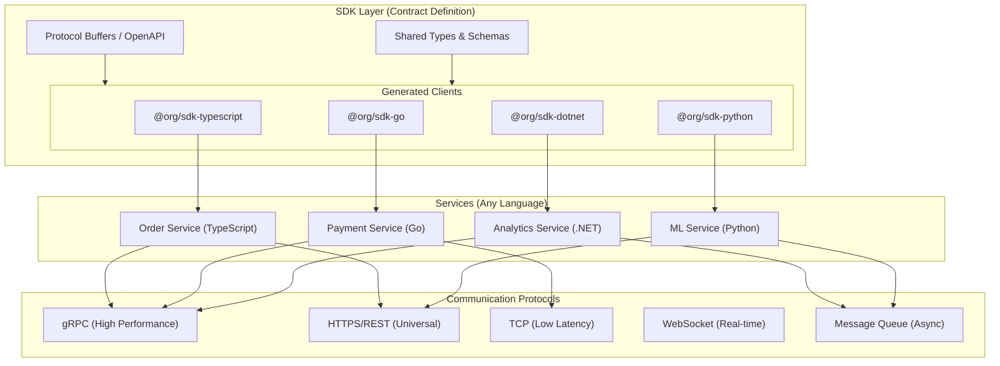
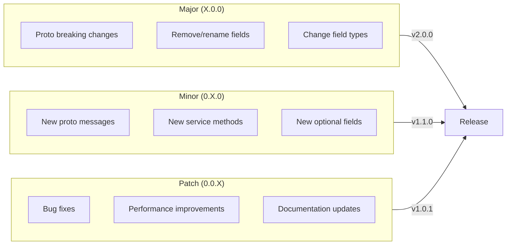

# Infrastructure as Code

**La arquitectura de monorepo con Infrastructure as Code (IaC)** combina todos los patrones arquitectónicos (microservicios, CQRS, event sourcing, serverless, hexagonal) en una base de código unificada y modular. Los servicios comparten SDKs comunes publicados como paquetes de npm, con pipelines de CI/CD que orquestan los despliegues en toda la organización.

<Callout type="info">
Esta arquitectura permite que los equipos desplieguen servicios de forma independiente mientras comparten la lógica de negocio central a través de SDKs internos, garantizando consistencia y reduciendo duplicación en toda la organización.
</Callout>


La forma que importa es la dirección de las dependencias. El transporte conoce al dominio; el dominio nunca conoce al transporte.

<Mermaid chart={`
flowchart TD
  T["Transporte<br/>HTTP · RPC · consumidor de colas"] --> A["Capa de API<br/>adaptadores delgados"]
  A --> C["Comandos<br/>lado de escritura"]
  A --> Q["Queries<br/>lado de lectura"]
  C --> R["Reglas<br/>invariantes"]
  Q --> R
  R --> S["Schema<br/>forma + índices"]
  C -.->|"eventos"| E["Triggers<br/>proyecciones, auditoría"]
`} />

<Callout type="warn">
La única regla que mantiene esto honesto: **el dominio no debe importar el transporte.** Si `commands.ts` importa un tipo de HTTP, el layering ya se perdió — solo que todavía no lo ves.
</Callout>

Esa dirección es lo que hace que un módulo sea extraíble. Una carpeta de dominio con su propio schema, reglas y comandos puede extraerse a un servicio separado sin arqueología, porque nada dentro de ella sabe cómo fue invocada.

<Files>
  <Folder name="domain" defaultOpen>
    <Folder name="catalog" defaultOpen>
      <File name="schema.ts" />
      <File name="rules.ts" />
      <File name="commands.ts" />
      <File name="queries.ts" />
      <File name="triggers.ts" />
    </Folder>
    <Folder name="shared">
      <File name="command.ts" />
      <File name="query.ts" />
      <File name="idempotency.ts" />
    </Folder>
  </Folder>
  <Folder name="api">
    <File name="catalog.ts" />
  </Folder>
</Files>

### ¿Por qué esta arquitectura?

<Accordions>
  <Accordion title="Una sola fuente de verdad">
    Todo el código, la infraestructura y las configuraciones viven en un solo repositorio. Los equipos pueden ver el sistema completo, entender las dependencias y hacer cambios transversales de forma atómica.
  </Accordion>
  <Accordion title="Lógica de negocio compartida">
    La lógica de dominio central vive en paquetes de SDK. Cuando las reglas de negocio cambian, actualizas una sola vez y todos los servicios reciben la actualización automáticamente a través de la gestión de dependencias.
  </Accordion>
  <Accordion title="Despliegue flexible">
    La misma base de código puede desplegarse como:
    - **Microservicios** en Kubernetes para producción a gran escala
    - **Serverless** en AWS Lambda para cargas de trabajo con costo optimizado
    - **Monolito** para desarrollo o despliegues pequeños
    - **Híbrido** mezclando estrategias por servicio
  </Accordion>
  <Accordion title="Releases coordinados">
    La orquestación del pipeline garantiza que cuando un SDK cambia, todos los servicios dependientes se prueban y despliegan juntos, evitando desajustes de versiones.
  </Accordion>
</Accordions>

# Módulos de SDK

Los SDKs son el **pegamento** entre tus servicios y la plataforma. Proveen interfaces type-safe que abstraen los protocolos de comunicación, permitiendo que servicios escritos en **cualquier lenguaje** interactúen sin fricción.

<Callout type="info">
El SDK define **contratos** (tipos, schemas, protocolos), no implementaciones. Un servicio en TypeScript, en Go o en .NET puede usar su SDK correspondiente para comunicarse usando el mismo protocolo subyacente (gRPC, HTTP, TCP, WebSocket).
</Callout>

### Vista general de la arquitectura



### Principio central: desarrollo contract-first

El SDK **define el contrato**, los servicios **implementan el contrato**. Esta separación habilita:

1. **Independencia de lenguaje**: genera clientes type-safe para cualquier lenguaje
2. **Flexibilidad de protocolo**: cambia entre gRPC, HTTP, TCP sin tocar la lógica de negocio
3. **Compatibilidad hacia atrás**: los contratos imponen estabilidad en la API
4. **Documentación**: los contratos sirven como documentación viva

<Tabs items={['Definición del contrato', 'Uso en TypeScript', 'Uso en Go', 'Uso en .NET']}>
<Tab value="Definición del contrato">
```protobuf title="proto/order/v1/order.proto"
syntax = "proto3";

package org.order.v1;

option go_package = "github.com/org/sdk-go/order/v1";
option csharp_namespace = "Org.Order.V1";

// Order service definition
service OrderService {
  // Create a new order
  rpc CreateOrder(CreateOrderRequest) returns (CreateOrderResponse);
  
  // Get order by ID
  rpc GetOrder(GetOrderRequest) returns (Order);
  
  // Stream order updates
  rpc WatchOrder(WatchOrderRequest) returns (stream OrderEvent);
  
  // List orders with filtering
  rpc ListOrders(ListOrdersRequest) returns (ListOrdersResponse);
}

message CreateOrderRequest {
  string customer_id = 1;
  repeated OrderItem items = 2;
  Address shipping_address = 3;
}

message CreateOrderResponse {
  string order_id = 1;
  OrderStatus status = 2;
  google.protobuf.Timestamp created_at = 3;
}

message Order {
  string id = 1;
  string customer_id = 2;
  repeated OrderItem items = 3;
  OrderStatus status = 4;
  Money total = 5;
  Address shipping_address = 6;
  google.protobuf.Timestamp created_at = 7;
  google.protobuf.Timestamp updated_at = 8;
}

message OrderItem {
  string product_id = 1;
  string product_name = 2;
  int32 quantity = 3;
  Money unit_price = 4;
}

message Money {
  int64 amount = 1;  // Amount in cents
  string currency = 2;
}

message Address {
  string street = 1;
  string city = 2;
  string state = 3;
  string postal_code = 4;
  string country = 5;
}

enum OrderStatus {
  ORDER_STATUS_UNSPECIFIED = 0;
  ORDER_STATUS_DRAFT = 1;
  ORDER_STATUS_PENDING = 2;
  ORDER_STATUS_CONFIRMED = 3;
  ORDER_STATUS_SHIPPED = 4;
  ORDER_STATUS_DELIVERED = 5;
  ORDER_STATUS_CANCELLED = 6;
}

message OrderEvent {
  string order_id = 1;
  OrderStatus previous_status = 2;
  OrderStatus new_status = 3;
  google.protobuf.Timestamp timestamp = 4;
}
```
</Tab>
<Tab value="Uso en TypeScript">
```typescript title="apps/api-gateway/src/orders.ts"
import { OrderServiceClient, CreateOrderRequest } from '@org/sdk-typescript';
import { GrpcTransport } from '@org/sdk-typescript/transports/grpc';
import { HttpTransport } from '@org/sdk-typescript/transports/http';

// Choose transport based on environment
const transport = process.env.USE_GRPC === 'true'
  ? new GrpcTransport({ host: 'order-service:50051' })
  : new HttpTransport({ baseUrl: 'https://order-service.internal' });

// Type-safe client
const orderClient = new OrderServiceClient(transport);

// Create order with full type safety
const createOrder = async (customerId: string, items: OrderItem[]) => {
  const request: CreateOrderRequest = {
    customerId,
    items: items.map(item => ({
      productId: item.productId,
      productName: item.name,
      quantity: item.quantity,
      unitPrice: { amount: item.price, currency: 'USD' },
    })),
    shippingAddress: {
      street: '123 Main St',
      city: 'New York',
      state: 'NY',
      postalCode: '10001',
      country: 'US',
    },
  };

  // Type-safe response
  const response = await orderClient.createOrder(request);
  
  console.log(`Order created: ${response.orderId}`);
  return response;
};

// Stream order updates
const watchOrder = async (orderId: string) => {
  const stream = orderClient.watchOrder({ orderId });
  
  for await (const event of stream) {
    console.log(`Order ${event.orderId}: ${event.previousStatus} -> ${event.newStatus}`);
  }
};
```
</Tab>
<Tab value="Uso en Go">
```go title="services/payment-service/main.go"
package main

import (
    "context"
    "log"
    
    orderv1 "github.com/org/sdk-go/order/v1"
    "github.com/org/sdk-go/transports/grpc"
)

func main() {
    // Create gRPC transport
    transport, err := grpc.NewTransport(grpc.Config{
        Host: "order-service:50051",
        TLS:  true,
    })
    if err != nil {
        log.Fatal(err)
    }
    defer transport.Close()

    // Type-safe client
    orderClient := orderv1.NewOrderServiceClient(transport)

    // Create order with full type safety
    resp, err := orderClient.CreateOrder(context.Background(), &orderv1.CreateOrderRequest{
        CustomerId: "cust-123",
        Items: []*orderv1.OrderItem{
            {
                ProductId:   "prod-456",
                ProductName: "Widget",
                Quantity:    2,
                UnitPrice:   &orderv1.Money{Amount: 2999, Currency: "USD"},
            },
        },
        ShippingAddress: &orderv1.Address{
            Street:     "123 Main St",
            City:       "New York",
            State:      "NY",
            PostalCode: "10001",
            Country:    "US",
        },
    })
    if err != nil {
        log.Fatal(err)
    }

    log.Printf("Order created: %s", resp.OrderId)
}
```
</Tab>
<Tab value="Uso en .NET">
```csharp title="Services/AnalyticsService/OrderAnalytics.cs"
using Org.Order.V1;
using Org.Sdk.Transports;

namespace AnalyticsService;

public class OrderAnalytics
{
    private readonly OrderServiceClient _orderClient;

    public OrderAnalytics(IConfiguration config)
    {
        // Create transport based on configuration
        var transport = config.GetValue<bool>("UseGrpc")
            ? new GrpcTransport(config["OrderService:GrpcHost"])
            : new HttpTransport(config["OrderService:HttpUrl"]);

        _orderClient = new OrderServiceClient(transport);
    }

    public async Task<OrderStats> GetOrderStatsAsync(string customerId)
    {
        // Type-safe request
        var request = new ListOrdersRequest
        {
            CustomerId = customerId,
            PageSize = 100,
        };

        // Type-safe response
        var response = await _orderClient.ListOrdersAsync(request);

        return new OrderStats
        {
            TotalOrders = response.TotalCount,
            TotalRevenue = response.Orders.Sum(o => o.Total.Amount),
            AverageOrderValue = response.Orders.Average(o => o.Total.Amount),
        };
    }

    public async IAsyncEnumerable<OrderEvent> WatchOrdersAsync(
        string orderId,
        [EnumeratorCancellation] CancellationToken ct = default)
    {
        var stream = _orderClient.WatchOrder(new WatchOrderRequest { OrderId = orderId });

        await foreach (var evt in stream.WithCancellation(ct))
        {
            yield return evt;
        }
    }
}
```
</Tab>
</Tabs>

## CQRS en la práctica

El patrón es fácil de nombrar y fácil de fingir. En una base de código real aparece como dos archivos distintos con dos formas distintas — las escrituras llevan una idempotency key y un permiso; las lecturas llevan paginación y nunca mutan.

<Tabs items={['Lado de escritura', 'Lado de lectura']}>
<Tab value="Lado de escritura">

Los comandos se registran, no se escriben a mano. El registry es dueño del permiso, la clasificación y el guard de tenant, así que cada operación los hereda:

```ts title="domain/catalog/commands.ts"
export const catalogCommands = new TenantCommand({
  defaults: {
    permission: 'catalog.manage',
    classification: 'restricted_mutable_master',
    guard: requireCatalogTenant,
  },
  operations: {
    'catalog.product.create': operation(
      createProductCommandSchema,
      products.publicDto,
      'product',
    ),
  },
})
```

La idempotencia es un argumento, no una convención — la misma key reproduce el resultado almacenado en lugar de escribir dos veces.

</Tab>
<Tab value="Lado de lectura">

Las queries nunca reciben una idempotency key y nunca escriben. Reciben paginación y devuelven un DTO mapeado:

```ts title="domain/catalog/queries.ts"
export const listProducts = TenantQuery.paginated({
  args: { categoryId: v.optional(v.id('productCategories')) },
  handler: (ctx, { categoryId, paginationOpts }) =>
    paginateMapped(
      ctx.table('products')
        .withIndex('by_tenant_archived_at', (q) =>
          q.eq('tenant', ctx.tenant).eq('archivedAt', undefined),
        ),
      paginationOpts,
      products.publicDto,
    ),
})
```

Nota que el índice empieza con `tenant`. En un sistema multi-tenant eso no es una optimización — es el límite de aislamiento.

</Tab>
</Tabs>

<Callout type="info">
La prueba de si de verdad tienes CQRS: ¿puedes cachear agresivamente el lado de lectura sin tocar el lado de escritura? Si una ruta de lectura puede mutar, la respuesta es no y la etiqueta es decoración.
</Callout>

## Protocolos de comunicación

| Protocolo | Caso de uso | Latencia | Características |
|----------|----------|---------|----------|
| **gRPC** | Servicio a servicio | Muy baja | Streaming, binario, HTTP/2 |
| **HTTPS/REST** | APIs públicas, navegadores | Baja | Universal, cacheable |
| **TCP** | Trading de alta frecuencia | Ultra baja | Raw sockets, framing custom |
| **WebSocket** | Actualizaciones en tiempo real | Baja | Bidireccional, persistente |
| **Message Queue** | Procesamiento async | Variable | Durabilidad, replay |


# Versionado y publicación

Gestiona **releases sincronizados** entre múltiples paquetes de SDK con versionado automatizado, changelogs y publicación a registries de paquetes.

<Callout type="warn">
Todos los SDKs **deben** usar la misma versión mayor para garantizar la compatibilidad de protocolo. Los breaking changes en las definiciones de proto requieren un bump de versión mayor en todos los SDKs.
</Callout>

### Estrategia de versionado



### Configuración de Changesets

```json title=".changeset/config.json"
{
  "$schema": "https://unpkg.com/@changesets/config@3.0.0/schema.json",
  "changelog": [
    "@changesets/changelog-github",
    { "repo": "org/platform" }
  ],
  "commit": false,
  "fixed": [
    ["@org/proto", "@org/sdk-typescript"]
  ],
  "linked": [],
  "access": "restricted",
  "baseBranch": "main",
  "updateInternalDependencies": "patch",
  "ignore": [],
  "privatePackages": {
    "version": true,
    "tag": true
  },
  "___experimentalUnsafeOptions_WILL_CHANGE_IN_PATCH": {
    "onlyUpdatePeerDependentsWhenOutOfRange": true
  }
}
```


## Menciones
- [Angel Lopez sobre Infrastructure as Code Monorepo](https://docs.imrlopez.dev/docs/code-quality/architecture/infrastructure-as-code)
