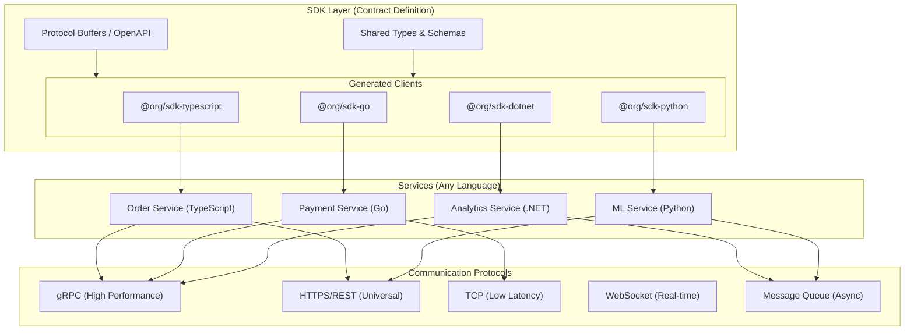
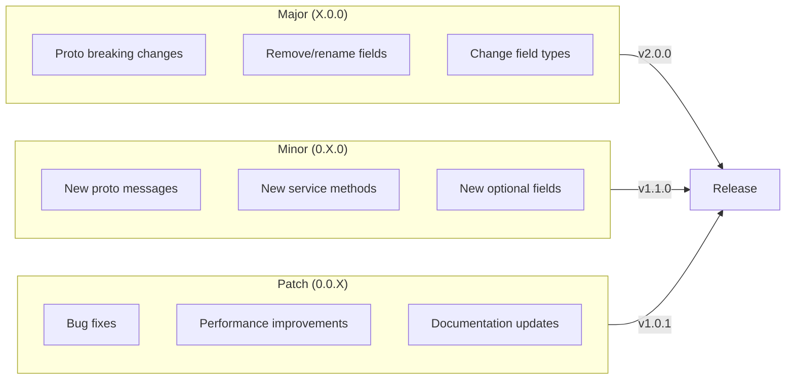

# Infrastructure as Code

**Infrastructure as Code (IaC) Monorepo Architecture** combines all architectural patterns (microservices, CQRS, event sourcing, serverless, hexagonal) into a unified, modular codebase. Services share common SDKs published as npm packages, with CI/CD pipelines that orchestrate deployments across the entire organization.

<Callout type="info">
This architecture enables teams to deploy services independently while sharing core business logic through internal SDKs, ensuring consistency and reducing duplication across the organization.
</Callout>


### Why This Architecture?

<Accordions>
  <Accordion title="Single Source of Truth">
    All code, infrastructure, and configurations live in one repository. Teams can see the entire system, understand dependencies, and make cross-cutting changes atomically.
  </Accordion>
  <Accordion title="Shared Business Logic">
    Core domain logic lives in SDK packages. When business rules change, update once and all services automatically get the update through dependency management.
  </Accordion>
  <Accordion title="Flexible Deployment">
    The same codebase can deploy as:
    - **Microservices** on Kubernetes for high-scale production
    - **Serverless** on AWS Lambda for cost-effective workloads
    - **Monolith** for development or small deployments
    - **Hybrid** mixing strategies per service
  </Accordion>
  <Accordion title="Coordinated Releases">
    Pipeline orchestration ensures that when an SDK changes, all dependent services are tested and deployed together, preventing version mismatches.
  </Accordion>
</Accordions>

# SDK Modules

SDKs are the **glue** between your services and the platform. They provide type-safe interfaces that abstract away communication protocols, allowing services written in **any language** to interact seamlessly.

<Callout type="info">
The SDK defines **contracts** (types, schemas, protocols), not implementations. A TypeScript service, Go service, or .NET service can all use their respective SDK to communicate using the same underlying protocol (gRPC, HTTP, TCP, WebSocket).
</Callout>

### Architecture Overview



### Core Principle: Contract-First Development

The SDK **defines the contract**, services **implement the contract**. This separation enables:

1. **Language Independence**: Generate type-safe clients for any language
2. **Protocol Flexibility**: Switch between gRPC, HTTP, TCP without changing business logic
3. **Backward Compatibility**: Contracts enforce API stability
4. **Documentation**: Contracts serve as living documentation

<Tabs items={['Contract Definition', 'TypeScript Usage', 'Go Usage', '.NET Usage']}>
<Tab value="Contract Definition">
```protobuf title="proto/order/v1/order.proto"
syntax = "proto3";

package org.order.v1;

option go_package = "github.com/org/sdk-go/order/v1";
option csharp_namespace = "Org.Order.V1";

// Order service definition
service OrderService {
  // Create a new order
  rpc CreateOrder(CreateOrderRequest) returns (CreateOrderResponse);
  
  // Get order by ID
  rpc GetOrder(GetOrderRequest) returns (Order);
  
  // Stream order updates
  rpc WatchOrder(WatchOrderRequest) returns (stream OrderEvent);
  
  // List orders with filtering
  rpc ListOrders(ListOrdersRequest) returns (ListOrdersResponse);
}

message CreateOrderRequest {
  string customer_id = 1;
  repeated OrderItem items = 2;
  Address shipping_address = 3;
}

message CreateOrderResponse {
  string order_id = 1;
  OrderStatus status = 2;
  google.protobuf.Timestamp created_at = 3;
}

message Order {
  string id = 1;
  string customer_id = 2;
  repeated OrderItem items = 3;
  OrderStatus status = 4;
  Money total = 5;
  Address shipping_address = 6;
  google.protobuf.Timestamp created_at = 7;
  google.protobuf.Timestamp updated_at = 8;
}

message OrderItem {
  string product_id = 1;
  string product_name = 2;
  int32 quantity = 3;
  Money unit_price = 4;
}

message Money {
  int64 amount = 1;  // Amount in cents
  string currency = 2;
}

message Address {
  string street = 1;
  string city = 2;
  string state = 3;
  string postal_code = 4;
  string country = 5;
}

enum OrderStatus {
  ORDER_STATUS_UNSPECIFIED = 0;
  ORDER_STATUS_DRAFT = 1;
  ORDER_STATUS_PENDING = 2;
  ORDER_STATUS_CONFIRMED = 3;
  ORDER_STATUS_SHIPPED = 4;
  ORDER_STATUS_DELIVERED = 5;
  ORDER_STATUS_CANCELLED = 6;
}

message OrderEvent {
  string order_id = 1;
  OrderStatus previous_status = 2;
  OrderStatus new_status = 3;
  google.protobuf.Timestamp timestamp = 4;
}
```
</Tab>
<Tab value="TypeScript Usage">
```typescript title="apps/api-gateway/src/orders.ts"
import { OrderServiceClient, CreateOrderRequest } from '@org/sdk-typescript';
import { GrpcTransport } from '@org/sdk-typescript/transports/grpc';
import { HttpTransport } from '@org/sdk-typescript/transports/http';

// Choose transport based on environment
const transport = process.env.USE_GRPC === 'true'
  ? new GrpcTransport({ host: 'order-service:50051' })
  : new HttpTransport({ baseUrl: 'https://order-service.internal' });

// Type-safe client
const orderClient = new OrderServiceClient(transport);

// Create order with full type safety
const createOrder = async (customerId: string, items: OrderItem[]) => {
  const request: CreateOrderRequest = {
    customerId,
    items: items.map(item => ({
      productId: item.productId,
      productName: item.name,
      quantity: item.quantity,
      unitPrice: { amount: item.price, currency: 'USD' },
    })),
    shippingAddress: {
      street: '123 Main St',
      city: 'New York',
      state: 'NY',
      postalCode: '10001',
      country: 'US',
    },
  };

  // Type-safe response
  const response = await orderClient.createOrder(request);
  
  console.log(`Order created: ${response.orderId}`);
  return response;
};

// Stream order updates
const watchOrder = async (orderId: string) => {
  const stream = orderClient.watchOrder({ orderId });
  
  for await (const event of stream) {
    console.log(`Order ${event.orderId}: ${event.previousStatus} -> ${event.newStatus}`);
  }
};
```
</Tab>
<Tab value="Go Usage">
```go title="services/payment-service/main.go"
package main

import (
    "context"
    "log"
    
    orderv1 "github.com/org/sdk-go/order/v1"
    "github.com/org/sdk-go/transports/grpc"
)

func main() {
    // Create gRPC transport
    transport, err := grpc.NewTransport(grpc.Config{
        Host: "order-service:50051",
        TLS:  true,
    })
    if err != nil {
        log.Fatal(err)
    }
    defer transport.Close()

    // Type-safe client
    orderClient := orderv1.NewOrderServiceClient(transport)

    // Create order with full type safety
    resp, err := orderClient.CreateOrder(context.Background(), &orderv1.CreateOrderRequest{
        CustomerId: "cust-123",
        Items: []*orderv1.OrderItem{
            {
                ProductId:   "prod-456",
                ProductName: "Widget",
                Quantity:    2,
                UnitPrice:   &orderv1.Money{Amount: 2999, Currency: "USD"},
            },
        },
        ShippingAddress: &orderv1.Address{
            Street:     "123 Main St",
            City:       "New York",
            State:      "NY",
            PostalCode: "10001",
            Country:    "US",
        },
    })
    if err != nil {
        log.Fatal(err)
    }

    log.Printf("Order created: %s", resp.OrderId)
}
```
</Tab>
<Tab value=".NET Usage">
```csharp title="Services/AnalyticsService/OrderAnalytics.cs"
using Org.Order.V1;
using Org.Sdk.Transports;

namespace AnalyticsService;

public class OrderAnalytics
{
    private readonly OrderServiceClient _orderClient;

    public OrderAnalytics(IConfiguration config)
    {
        // Create transport based on configuration
        var transport = config.GetValue<bool>("UseGrpc")
            ? new GrpcTransport(config["OrderService:GrpcHost"])
            : new HttpTransport(config["OrderService:HttpUrl"]);

        _orderClient = new OrderServiceClient(transport);
    }

    public async Task<OrderStats> GetOrderStatsAsync(string customerId)
    {
        // Type-safe request
        var request = new ListOrdersRequest
        {
            CustomerId = customerId,
            PageSize = 100,
        };

        // Type-safe response
        var response = await _orderClient.ListOrdersAsync(request);

        return new OrderStats
        {
            TotalOrders = response.TotalCount,
            TotalRevenue = response.Orders.Sum(o => o.Total.Amount),
            AverageOrderValue = response.Orders.Average(o => o.Total.Amount),
        };
    }

    public async IAsyncEnumerable<OrderEvent> WatchOrdersAsync(
        string orderId,
        [EnumeratorCancellation] CancellationToken ct = default)
    {
        var stream = _orderClient.WatchOrder(new WatchOrderRequest { OrderId = orderId });

        await foreach (var evt in stream.WithCancellation(ct))
        {
            yield return evt;
        }
    }
}
```
</Tab>
</Tabs>

## Communication Protocols

| Protocol | Use Case | Latency | Features |
|----------|----------|---------|----------|
| **gRPC** | Service-to-service | Very Low | Streaming, binary, HTTP/2 |
| **HTTPS/REST** | Public APIs, browsers | Low | Universal, cacheable |
| **TCP** | High-frequency trading | Ultra Low | Raw sockets, custom framing |
| **WebSocket** | Real-time updates | Low | Bi-directional, persistent |
| **Message Queue** | Async processing | Variable | Durability, replay |


# Versioning & Publishing

Manage **synchronized releases** across multiple SDK packages with automated versioning, changelogs, and publishing to package registries.

<Callout type="warn">
All SDKs **must** use the same major version to ensure protocol compatibility. Breaking changes in proto definitions require a major version bump across all SDKs.
</Callout>

### Versioning Strategy



### Changesets Configuration

```json title=".changeset/config.json"
{
  "$schema": "https://unpkg.com/@changesets/config@3.0.0/schema.json",
  "changelog": [
    "@changesets/changelog-github",
    { "repo": "org/platform" }
  ],
  "commit": false,
  "fixed": [
    ["@org/proto", "@org/sdk-typescript"]
  ],
  "linked": [],
  "access": "restricted",
  "baseBranch": "main",
  "updateInternalDependencies": "patch",
  "ignore": [],
  "privatePackages": {
    "version": true,
    "tag": true
  },
  "___experimentalUnsafeOptions_WILL_CHANGE_IN_PATCH": {
    "onlyUpdatePeerDependentsWhenOutOfRange": true
  }
}
```


## Mentions
- [Angel Lopez on Infrastructure as Code Monorepo](https://docs.imrlopez.dev/docs/code-quality/architecture/infrastructure-as-code)